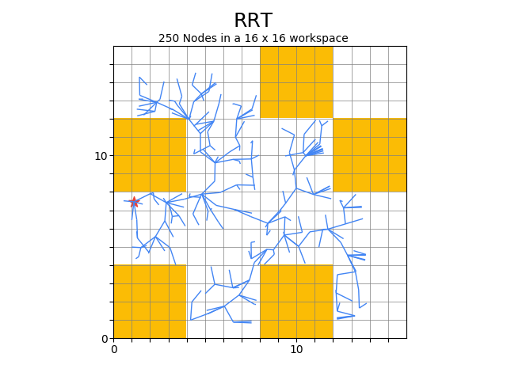
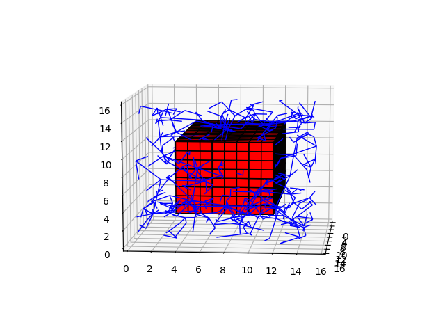

# Rapidly-Exploring Radom Tree :earth_asia:
> Simple Occupancy-Grid-Map based RRT implementation in C

This repository holds a C implementation of Rapidly-Exploring Random Tree, built as the function of interest in my [Senior Thesis](https://github.com/AnthonyKenny98/Thesis). It has a 3D and 2D implementation and has functionality for analysis of performance.

3D                                 | 2D
:---------------------------------:|:------------------------------:
 | 

## Table of Contents
+ [License](#license)

## License

