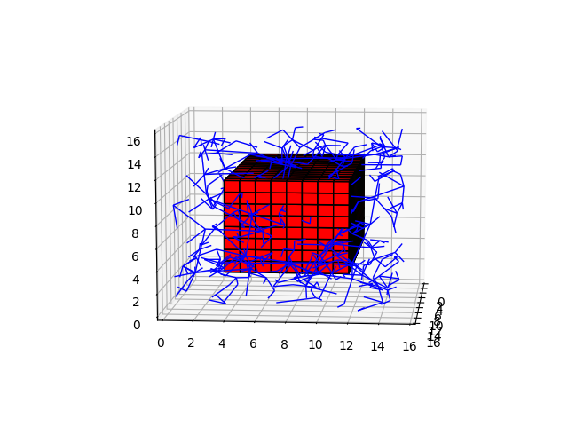

# RRT
> Simple OCM based RRT implementation in C

This repository holds a C implementation of Rapidly-Exploring Random Tree, built as the function of interest in my [Senior Thesis](https://github.com/AnthonyKenny98/Thesis). It has a 3D and 2D branch

