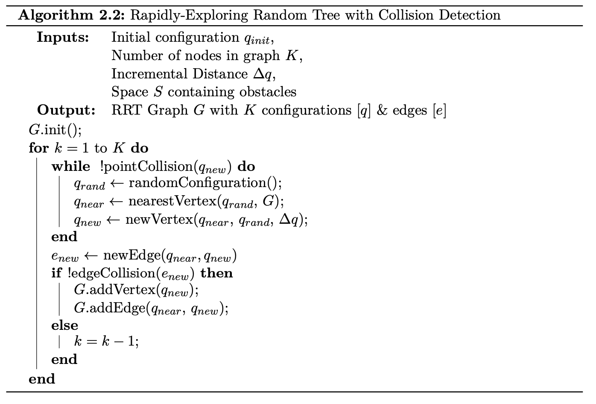

# Rapidly-Exploring Random Tree :earth_asia:
> 2D and 3D Implementation of RRT 

This repository holds a C implementation of Rapidly-Exploring Random Tree, built as the function of interest in my [Senior Thesis](https://github.com/AnthonyKenny98/Thesis). It has a 3D and 2D implementation and has functionality for analysis of performance.

2D                                 | 3D
:---------------------------------:|:------------------------------:
| 

## Table of Contents
+ [Background](#background)
+ [License](#license)

## Background
RRT is an algorithm designed to efficiently search, and thus plan a path through, a high- complexity environment by randomly sampling points and building a tree.

Put simply, RRT builds a tree (referred to as a graph) of possible configurations, connected by edges, for a robot of some physical description. It does so by randomly sampling the configuration space and adding configurations to the graph. From this graph, a path from the initial configuration to some goal configuration can be found, given a high enough number of iterations. The algorithm can be seen below (taken from [Thesis writeup](https://github.com/AnthonyKenny98/Thesis/blob/master/Writeups/4_Report/obj/report.pdf))

## License

This project is licensed under the MIT License. See the [LICENSE](LICENSE) file for more information.
